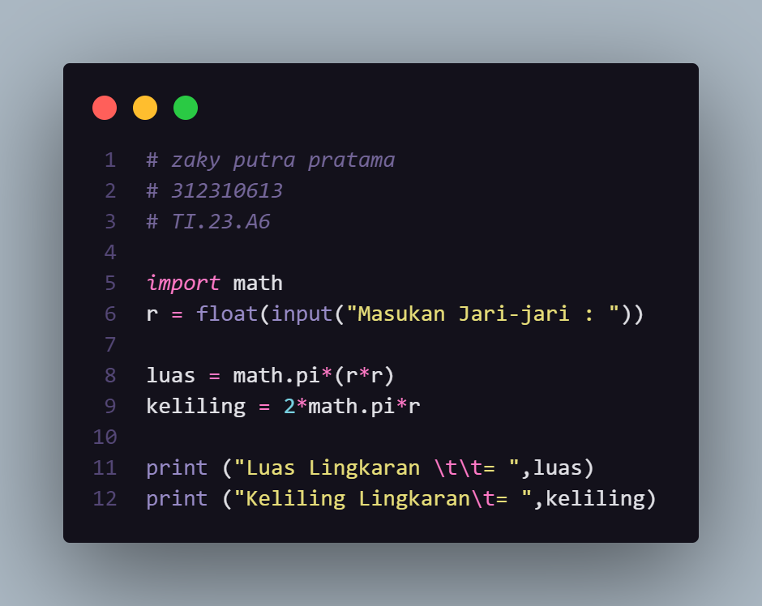
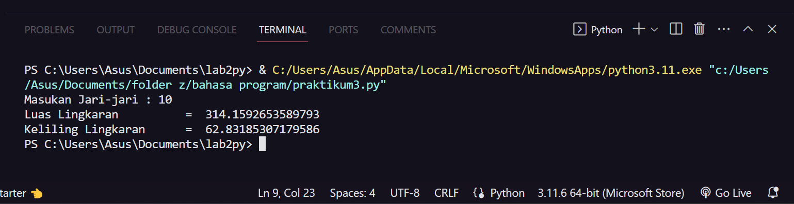
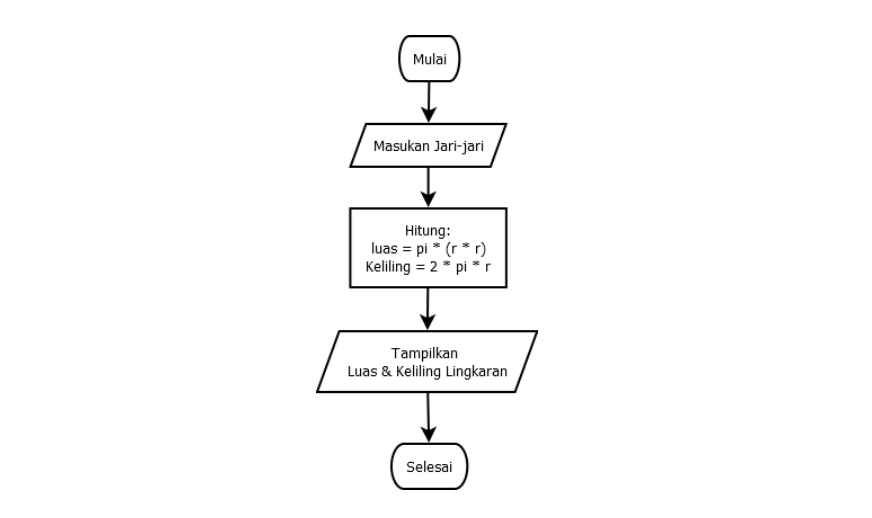

# praktikum3.zaky

<h1>KELILING DAN LUAS LINGKARAN</h1>

+ 
buka IDE

+ 
import math

+ 
r = float(input("Masukan Jari-jari : "))

+ 
luas = math.pi*(r*r)

+ 
keliling = 2*math.pi*r

+ 
print ("Luas Lingkaran \t\t= ",luas)

+ 
print ("Keliling Lingkaran\t= ",keliling)

